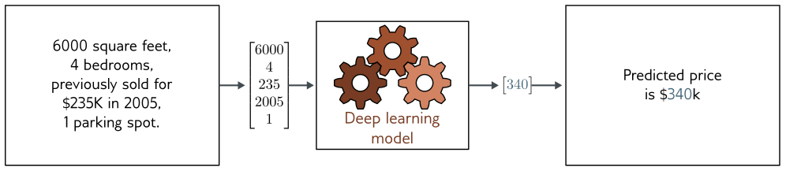
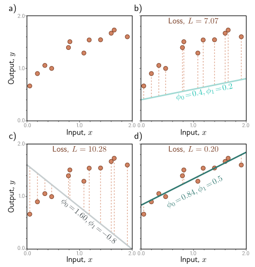
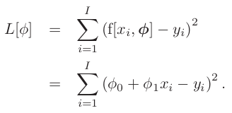
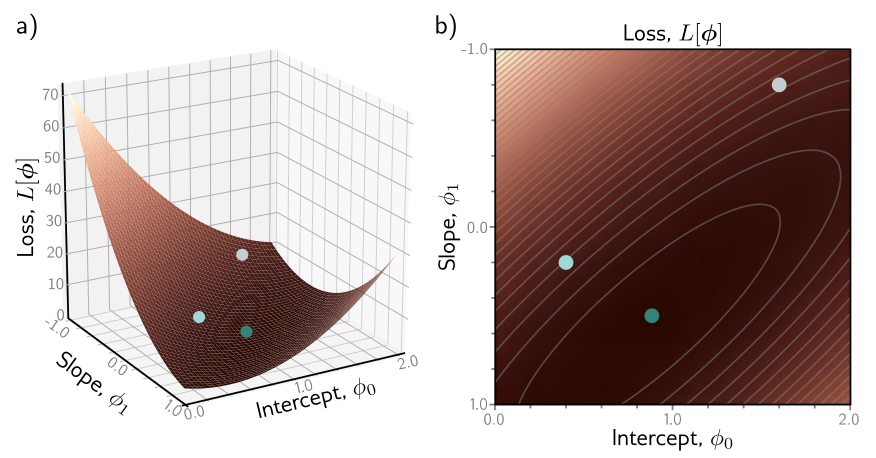
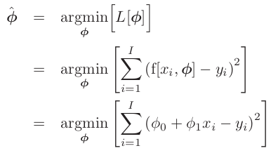
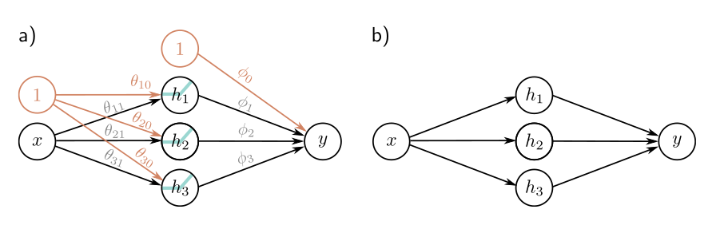
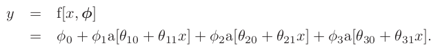
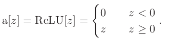
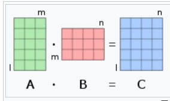

# Chapter 1 - Introduction

Artificial intelligence is concernened with building systems that simulate intelligent behaviour. Machine learning is a subset of AI that learns to make decisions by fitting mathematical models to observed data. Deep neuronal network is a type of machine learning model, when is fitted to data is called deep learning. At the time of writting, deep networks are the most powrful and practical machine learning model. Some powerful aplications are to Translate texts (natural language processing), search images (computer vision) or converse speaking (speech recognition).

There are 3 types of machine learning methods:

* **Supervised**:
* **Unsupervised**:
* **Reinforcement** learning:

## Supervised Learning

Define a mapping from input to an ouput prediction

### **Inputs:**

1. **Tabular data / Structured:** Fixed lenght vector, where order does not matter.
2. **Body Text**: Variable lenght inputs (depends of the number of words for example), the order matters.
3. **High Dimesional**: Audio or images may have a fixed size lenght vector but can they can be enormus.

### **Outputs:**

* **Regression** Problem: The model returns a continous number

Example: Predict the price of a house given the square meters, the amount of bedrooms, the previous value and the amount of parking spots. It will return a value

* **Classification**: The model return the probabilities that the input belongs to each category.

  - Binary classification: Only 2 categories
  - Muticlass classification: N number of possible categories

Example: Predict the object that appears in a picture

## Unsupervised Learning

Constructing a model from input data without corresponding output labels. Rather than learning a mapping from input to output, the goal is to describe or understand the structure of the data

**Latent variables:** Some (but not all) generative models exploit the observation that data can be lower dimensional than the raw number of observed variables suggests. They can represent different distributions between the data, reveling internal patterns or non evident patterns. It can help with the generalization of the models to new data.

## **Connecting Supervised and Unsupervised**

It can be useful to use this two tools together. For example imagine the case of generating an image from a caption.

Rather than directly map the text input to an image, we can learn a relation between latent variables that explain the text and the latent variables that explain the image.This has three advantages.
First, we may need fewer text/image pairs to learn this mapping now that the inputs and outputs are lower dimensional.
Second, we are more likely to generate a plausible-looking image; any sensible values of the latent variables
should produce something that looks like a plausible example.
Third, if we introduce randomness to either the mapping between the two sets of latent variables or the mapping from the latent variables to the image, then we can generate multiple images that are all described well by the caption

## Reinforcement learning

The field will study the idea of an agent that lives in a world that can perform certain actions at each step. The actions taken might change the state of the world but not necessarily in a deterministic way. Each action can also produce rewards and the main goal of reinforcement learning is to make the agent choose the action that leads to highest rewards on average.

The main problem we face is the rewards may occur some time after the action is taken, so associating the reward with an action is not straightforward. This is known as the **temporal credit assignment problem.**

As the agent learns, it must balance the exploration of new strategies and exploitation of what it already knows; perhaps the agent has already learned how to receive modest rewards; should it follow this strategy (exploit what it knows), or should it try different actions to see if it can improve (explore other opportunities)?

## **Ethics**

This potent technology will change the world to at least the same extent as electricity, the internal combustion engine, the transistor, or the internet. The potencial benefits in healthcare, design, entertainment, transport, education, and almost every area of commerce are enormous. But scientists and engineers are often unrealistically optimistic about the outcomes of their work, and the potencial of harm is just as great. We will highlight 5 concers:

1. **Bias and fairness:** If we train a system to predict salary levels based of historical data, then this system will reproduce historical biases; for example it will reproduce that woman should be paid less than men, maybe racist behaviours. Careless application of algorithmic decision-making using AI has the potential to entrench or aggravate existing biases.
   Bias -> Sesgo
2. **Explainability:** Deep learning systems make decisions, but we do not usually know exactly how or based on what information. They may contain billions of parameters, and there is no way we can understand how they work based on examination
3. **Weaponizing AI:** All significant technologies have been applied directly or indirectly toward war. Sadly, violent conflict seems to be an inevitable feature of human behavior.
   AI is arguably the most powerful technology ever built and will doubtless be deployed extensively in a military context. Indeed, this is already happening
4. **Concentrating power:** It is not from a benevolent interest in improving the lot of the human race that the world’s most powerful companies are investing heavily in artifi-
   cial intelligence. They know that these technologies will allow them to reap enormous profits. Like any advanced technology, deep learning is likely to concentrate power in the hands of the few organizations that control it.
5. **Existential risk:** The major existential risks to the human race all result from technology. Climate change has been driven by industrialization. Nuclear weapons derive from the study of physics. Pandemics are more probable and spread faster because innovations in transport, agriculture, and construction have allowed a larger, denser, and more interconnected population. Artificial intelligence brings new existential risks. We should be very cautious about building systems that are more capable and extensible than human beings.

---

# Chapter 2 - Supervised Learning

To make the prediction, we need a model f[•] that takes input x and returns y, so:

    y = f[x].

When we compute the prediction y from the input x, we call this **inference**

The model also contains **parameters** ϕ. The choice of parameters determines the particular relation between input and output, so we should really write:
	y = f[x, ϕ].
When we talk about learning or training a model, we mean that we attempt to find parameters ϕ that make sensible output predictions from the input. We learn these
parameters using a **training dataset** of I pairs of input and output examples {xi , yi }.
We aim to select parameters that map each training input to its associated output as closely as possible. We quantify the degree of mismatch in this mapping with the **loss L**. This is a scalar value that summarizes how poorly the model predicts the training outputs from their corresponding inputs for parameters ϕ.

We can treat the loss as a function L[ϕ] of these parameters. When we train the model, we are seeking parameters ϕ̂ that **minimize this loss function:**

    ϕ̂ = argmin L [ϕ] .

If the loss is small after this minimization, we have found model parameters that accurately predict the training outputs yi from the training inputs xi .
After training a model, we must now assess its performance; we run the model on separate **test data** to see how well it **generalizes** to examples that it didn’t observe during training. If the performance is adequate, then we are ready to deploy the model.

## Linear Regression

A 1D **linear regression model** describes the relationship between input x and output y as a straight line:

    y = f[x, ϕ]
	y= ϕ0 + ϕ1 x.

## Loss

We need a principled approach for deciding which parameters ϕ are better than others. To this end, we assign a numerical value to each choice of parameters that quantifies the degree of mismatch between the model and the data. We term this value the loss; a lower loss means a better fit.
The mismatch is captured by the deviation between the model predictions f[xi , ϕ] (height of the line at xi ) and the ground truth outputs yi. These deviations are depicted
as orange dashed lines. 

We quantify the total mismatch, training error, or loss as the sum of the squares of these deviations for all I training pairs:

There are only two parameters (the y-intercept ϕ0 and slope ϕ1 ), so we can calculate the loss for every combination of values and visualize the loss function as a surface. The “best” parameters are at the minimum of this surface

## Loss function / Cost function

We term L[ϕ] the loss function or cost function. The goal is to find the parameters ϕ̂ that minimize this quantity:

## Training

The process of finding parameters that minimize the loss is termed model fitting, training or learning. The basic method is to choose the initial parameters randomly and then improve them by “walking down” the loss function until we reach the bottom.
One way to do this is to measure the gradient of the surface at the current position and take a step in the direction that is most steeply downhill. Then we repeat this process until the gradient is flat and we can improve no further.

## Testing

Having trained the model, we want to know how it will perform in the real world. We do this by computing the loss on a separate set of test data. The degree to which the prediction accuracy generalizes to the test data depends in part on how representative and complete the training data is. However, it also depends on how expressive the model is. 

A simple model like a line might not be able to capture the true relationship between input and output. This is known as **underfitting**.
Conversely, a very expressive model may describe statistical peculiarities of the training data that are atypical and lead to unusual predictions. This is known as **overfitting**.

---

# Chapter 3 - Shallow neuronal networks

Introduce the main ideas using an example network f[x, ϕ] that maps a scalar input x 
to a scalar output y and has ten parameters ϕ = {ϕ0 , ϕ1 , ϕ2 , ϕ3 , θ10 , θ11 , θ20 , θ21 , θ30 , θ31 }:

We can break down this calculation into three parts:

- first, we compute three linear functions of the input data (θ10 + θ11 x, θ20 + θ21 x, and θ30 + θ31 x).
- Second, we pass the three results through an **activation function a[•]**.
- Finally, we weight the three resulting activations with ϕ1 , ϕ2 , and ϕ3 , sum them, and add an offset ϕ0

To complete the description, we must define the **activation function** **a[•].** There are
many possibilities, but the most common choice is the rectified linear unit or **ReLU:**

    	

Returns Input if positive of 0 otherwise.

Advantages of ReLU:

1. Simplicity. Low computational costs
2. Sparsity. Many neurons will not activate (output equals 0) at the same time, which is beneficial for efficiency and interpretability of the model.
3. Mitigation of the Vanishing Gradient Problem: This problem occurs when gradients are too small, making the training of the network very slow. ReLU, having larger gradients, helps to maintain the gradients during training.

Limitations:

1. "Dying" Neurons: This happens when many inputs to the neuron are negative, leading to the neuron never activating (output equals 0). If this occurs, the gradient through that neuron will always be 0, preventing it from learning.
2. Exploding Gradients: in very deep networks, gradients can become very large, leading to the exploding gradient problem

## Matrix Multiplication

