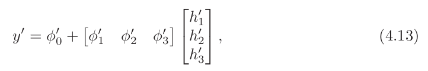
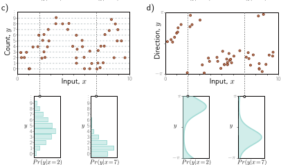
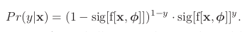

# Chapter 1 - Introduction

Artificial intelligence is concernened with building systems that simulate intelligent behaviour. Machine learning is a subset of AI that learns to make decisions by fitting mathematical models to observed data. Deep neuronal network is a type of machine learning model, when is fitted to data is called deep learning. At the time of writting, deep networks are the most powrful and practical machine learning model. Some powerful aplications are to Translate texts (natural language processing), search images (computer vision) or converse speaking (speech recognition).

There are 3 types of machine learning methods:

* **Supervised**
* **Unsupervised**
* **Reinforcement** **learning**

## Supervised Learning

Define a mapping from input to an ouput prediction

### **Inputs:**

1. **Tabular data / Structured:** Fixed lenght vector, where order does not matter.
2. **Body Text**: Variable lenght inputs (depends of the number of words for example), the order matters.
3. **High Dimesional**: Audio or images may have a fixed size lenght vector but can they can be enormus.

### **Outputs:**

* **Regression** **Problem**: The model returns a continous number

Example: Predict the price of a house given the square meters, the amount of bedrooms, the previous value and the amount of parking spots. It will return a value

* **Classification**: The model return the probabilities that the input belongs to each category.

  - **Binary** classification: Only 2 categories
  - **Muticlass** classification: N number of possible categories

Example: Predict the object that appears in a picture

## Unsupervised Learning

Constructing a model from input data without corresponding output labels. Rather than learning a mapping from input to output, the goal is to describe or understand the structure of the data

**Latent variables:** Some (but not all) generative models exploit the observation that data can be lower dimensional than the raw number of observed variables suggests. They can represent different distributions between the data, reveling internal patterns or non evident patterns. It can help with the generalization of the models to new data.

## **Connecting Supervised and Unsupervised**

It can be useful to use this two tools together. For example imagine the case of generating an image from a caption.

Rather than directly map the text input to an image, we can learn a relation between latent variables that explain the text and the latent variables that explain the image. This has three advantages:

- First, we may need fewer text/image pairs to learn this mapping now that the inputs and outputs are lower dimensional.
- Second, we are more likely to generate a plausible-looking image; any sensible values of the latent variables should produce something that looks like a plausible example.
- Third, if we introduce randomness to either the mapping between the two sets of latent variables or the mapping from the latent variables to the image, then we can generate multiple images that are all described well by the caption

## Reinforcement learning

The field will study the idea of an agent that lives in a world that can perform certain actions at each step. The actions taken might change the state of the world but not necessarily in a deterministic way. Each action can also produce rewards and the main goal of reinforcement learning is to make the agent choose the action that leads to highest rewards on average.

The main problem we face is the rewards may occur some time after the action is taken, so associating the reward with an action is not straightforward. This is known as the **temporal credit assignment problem.**

As the agent learns, it must balance the exploration of new strategies and exploitation of what it already knows; perhaps the agent has already learned how to receive modest rewards; should it follow this strategy (exploit what it knows), or should it try different actions to see if it can improve (explore other opportunities)?

## **Ethics**

This potent technology will change the world to at least the same extent as electricity, the internal combustion engine, the transistor, or the internet. The potencial benefits in healthcare, design, entertainment, transport, education, and almost every area of commerce are enormous. But scientists and engineers are often unrealistically optimistic about the outcomes of their work, and the potencial of harm is just as great. We will highlight 5 concers:

1. **Bias and fairness:** If we train a system to predict salary levels based of historical data, then this system will reproduce historical biases; for example it will reproduce that woman should be paid less than men, maybe racist behaviours. Careless application of algorithmic decision-making using AI has the potential to entrench or aggravate existing biases.
   Bias -> Sesgo
2. **Explainability:** Deep learning systems make decisions, but we do not usually know exactly how or based on what information. They may contain billions of parameters, and there is no way we can understand how they work based on examination
3. **Weaponizing AI:** All significant technologies have been applied directly or indirectly toward war. Sadly, violent conflict seems to be an inevitable feature of human behavior.
   AI is arguably the most powerful technology ever built and will doubtless be deployed extensively in a military context. Indeed, this is already happening
4. **Concentrating power:** It is not from a benevolent interest in improving the lot of the human race that the world’s most powerful companies are investing heavily in artificial intelligence. They know that these technologies will allow them to reap enormous profits. Like any advanced technology, deep learning is likely to concentrate power in the hands of the few organizations that control it.
5. **Existential risk:** The major existential risks to the human race all result from technology. Climate change has been driven by industrialization. Nuclear weapons derive from the study of physics. Pandemics are more probable and spread faster because innovations in transport, agriculture, and construction have allowed a larger, denser, and more interconnected population. Artificial intelligence brings new existential risks. We should be very cautious about building systems that are more capable and extensible than human beings.

---

# Chapter 2 - Supervised Learning

To make the prediction, we need a model f[•] that takes input x and returns y, so:

    y = f[x].

When we compute the prediction y from the input x, we call this **inference**

The model also contains **parameters** ϕ. The choice of parameters determines the particular relation between input and output, so we should really write:
	y = f[x, ϕ].
When we talk about learning or training a model, we mean that we attempt to find parameters ϕ that make sensible output predictions from the input. We learn these parameters using a **training dataset** of I pairs of input and output examples {xi , yi }.
We aim to select parameters that map each training input to its associated output as closely as possible. We quantify the degree of mismatch in this mapping with the **loss L**. This is a scalar value that summarizes how poorly the model predicts the training outputs from their corresponding inputs for parameters ϕ.

We can treat the loss as a function L[ϕ] of these parameters. When we train the model, we are seeking parameters ϕ̂ that **minimize this loss function:**

    ϕ̂ = argmin L [ϕ] .

If the loss is small after this minimization, we have found model parameters that accurately predict the training outputs yi from the training inputs xi .
After training a model, we must now assess its performance; we run the model on separate **test data** to see how well it **generalizes** to examples that it didn’t observe during training. If the performance is adequate, then we are ready to deploy the model.

## Linear Regression

A 1D **linear regression model** describes the relationship between input x and output y as a straight line:

    y = f[x, ϕ]
	y= ϕ0 + ϕ1 x.

## Loss

We need a principled approach for deciding which parameters ϕ are better than others. To this end, we assign a numerical value to each choice of parameters that quantifies the degree of mismatch between the model and the data. We term this value the loss; a lower loss means a better fit.
The mismatch is captured by the deviation between the model predictions f[xi , ϕ] (height of the line at xi ) and the ground truth outputs yi. These deviations are depicted as orange dashed lines.

We quantify the total mismatch, training error, or loss as the sum of the squares of these deviations for all I training pairs:

There are only two parameters (the y-intercept ϕ0 and slope ϕ1 ), so we can calculate the loss for every combination of values and visualize the loss function as a surface. The “best” parameters are at the minimum of this surface

## Loss function / Cost function

We term L[ϕ] the loss function or cost function. The goal is to find the parameters ϕ̂ that minimize this quantity:

## Training

The process of finding parameters that minimize the loss is termed model fitting, training or learning. The basic method is to choose the initial parameters randomly and then improve them by “walking down” the loss function until we reach the bottom.
One way to do this is to measure the gradient of the surface at the current position and take a step in the direction that is most steeply downhill. Then we repeat this process until the gradient is flat and we can improve no further.

## Testing

Having trained the model, we want to know how it will perform in the real world. We do this by computing the loss on a separate set of test data. The degree to which the prediction accuracy generalizes to the test data depends in part on how representative and complete the training data is. However, it also depends on how expressive the model is.

- A simple model like a line might not be able to capture the true relationship between input and output. This is known as **underfitting**.
- Conversely, a very expressive model may describe statistical peculiarities of the training data that are atypical and lead to unusual predictions. This is known as **overfitting**.

---

# Chapter 3 - Shallow neuronal networks

Introduce the main ideas using an example network f[x, ϕ] that maps a scalar input x
to a scalar output y and has ten parameters ϕ = {ϕ0 , ϕ1 , ϕ2 , ϕ3 , θ10 , θ11 , θ20 , θ21 , θ30 , θ31 }:

We can break down this calculation into three parts:

- first, we compute three linear functions of the input data (θ10 + θ11 x, θ20 + θ21 x, and θ30 + θ31 x).
- Second, we pass the three results through an **activation function a[•]**.
- Finally, we weight the three resulting activations with ϕ1 , ϕ2 , and ϕ3 , sum them, and add an offset ϕ0

To complete the description, we must define the **activation function** **a[•].** There are
many possibilities, but the most common choice is the rectified linear unit or **ReLU:**

    

Returns Input if positive of 0 otherwise.

Advantages of ReLU:

1. Simplicity. Low computational costs
2. Sparsity. Many neurons will not activate (output equals 0) at the same time, which is beneficial for efficiency and interpretability of the model.
3. Mitigation of the Vanishing Gradient Problem: This problem occurs when gradients are too small, making the training of the network very slow. ReLU, having larger gradients, helps to maintain the gradients during training.

Limitations:

1. "Dying" Neurons: This happens when many inputs to the neuron are negative, leading to the neuron never activating (output equals 0). If this occurs, the gradient through that neuron will always be 0, preventing it from learning.
2. Exploding Gradients: in very deep networks, gradients can become very large, leading to the exploding gradient problem

## Matrix Multiplication

## Terminology

* Layers, neurons and weights:

  
* When we pass data through the network, the values of the inputs to the hidden layer (i.e., before the ReLU functions are applied) are termed **pre-activations**.
* The values at the hidden layer (i.e., after the ReLU functions) are termed **activations**.
* Neural network with at least one hidden layer is also called a **multi-layer perceptron, MLP**
* Networks with one hidden layer (as described in this chapter) are sometimes referred to as **shallow neural networks**
* Networks with multiple hidden layers (as described in the next chapter) are referred to as **deep neural networks**
* Neural networks in which the connections form an acyclic graph (i.e., a graph with no loops, as in all the examples in this chapter) are referred to as **feed-forward networks**
* If every element in one layer connects to every element in the next (as in all the examples in this chapter), the network is **fully connected**
* **Weights** are the arrows and the offset parameters are the **biases**

---

# Chapter 4 - Deep neuronal networks

Consider the general case of a deep network with two hidden layers, each containing three hidden units:

The first layer is defined by:

The second layer:

Output layer:

Regardless, it’s important not to lose sight of the fact that this is still merely an equation relating input x to output y ′ . Indeed, we can combine equations to get one expression:

although this is admittedly rather difficult to understand.

## Hyperparameters

* The number of hidden units in each layer is referred to as the **width** of the network, the total number of hidden units is a measure of the network’s capacity
* The number of hidden layers as the **depth**

We denote the number of layers as K and the number of hidden units in each layer as D1 , D2 , . . . , DK . These are examples of **hyperparameters**. They are quantities chosen before we learn the model parameters

## Matrix Notation

We can describe this formulas 4.7-4.9 with a matrix notation:

For input and activation:

For output:

Or even more compact:

where, in each case, the function a[•] applies the activation function separately to every
element of its vector input.

## General Formulation

This notation becomes cumbersome for networks with many layers. Hence, from now on, we will describe the vector of hidden units at layer k as hk , the vector of **biases** (intercepts) that contribute to hidden layer k +1 as **βk** , and the **weights** (slopes) that are applied to the k th layer and contribute to the (k+1)th layer as **Ωk**. A general deep network y = f[x, ϕ] with K layers can now be written as:

We can equivalently write the network as a single function:

### Number of linear regions per parameter

### Depth efficiency

Both deep and shallow networks can model arbitrary functions, but some functions can be approximated much more efficiently with deep networks. Functions have been identified that require a shallow network with exponentially more hidden units to achieve an equivalent approximation to that of a deep network. This phenomenon is referred to as the **depth efficiency** of neural networks. This property is also attractive, but it’s not clear that the real-world functions that we want to approximate fall into this category.

### Large, structured inputs

We have discussed fully connected networks where every element of each layer contributes to every element of the subsequent one. However, these are not practical for large structured inputs like images, where the input might comprise ∼ 106 pixels.

The number of parameters would be excessively high, and moreover, we want different parts of the image to be processed similarly; there is no point in independently learning to recognize the same object at every possible position in the image.

The solution is to process local image regions in parallel and then gradually integrate information from increasingly large regions. This kind of local-to-global processing is difficult to specify without using multiple layers.

### Training and generalization

A further possible advantage of deep networks over shallow networks is their ease of fitting; it is usually easier to train moderately deep networks than to train shallow ones. It may be that over-parameterized deep models have a large family of roughly equivalent solutions that are easy to find. However, as we add more hidden layers, training becomes more difficult again, although many methods have been developed to mitigate this problem (see chapter 11).

Deep neural networks also seem to generalize to new data better than shallow ones. In practice, the best results for most tasks have been achieved using networks with tens or hundreds of layers. Neither of these phenomena are well understood, and we return to them in chapter 20.

---

# Chapter 5 - Loss functions

When we train models, we seek the parameters that produce the best possible mapping from input to output for the task we are considering. This chapter defines what is meant by the “best possible” mapping.

A loss function or cost function L[ϕ] returns a single number that describes the mismatch between the model predictions f[xi , ϕ] and their corresponding ground-truth outputs y

## Maximum likelihood

Until now, we have implied that the model directly computes a prediction y. We now shift perspective and consider the model as computing a conditional probability distribution P r(y|x) over possible outputs y given input x

We now shift perspective and consider the model as computing a conditional probability distribution P r(y|x) over possible outputs y given input x

The combined probability term is the likelihood of the parameters, and hence equation 5.1 is known as the **maximum likelihood criterion:**

Each term P r(yi |f[xi , ϕ]) can be small, so the product of many of these terms can be tiny. It may be difficult to represent this quantity with finite precision arithmetic. Fortunately, we can equivalently maximize the logarithm of the likelihood:

**TRANSFORM INTO LOG**

We apply the property of the logarithm that a if log(a*b) = log(a) + log(b). This makes the operations be a sum of probabilities instead of a multiplication of them

**Why do we do this?**

This log-likelihood criterion is equivalent because the logarithm is a monotonically increasing function: if z > z ′ , then log[z] > log[z ′ ] and vice versa (figure 5.2). It follows that when we change the model parameters ϕ to improve the log-likelihood criterion, we also improve the original maximum likelihood criterion. It also follows that the overall maxima of the two criteria must be in the same place, so the best model parameters ϕ̂ are the same in both cases. However, the log-likelihood criterion has the practical advantage of using a sum of terms, not a product, so representing it with finite precision isn’t problematic.

### Minimum likelihood

**Why is better to look for the minimum loss rather than the maximum?**

Finally, we note that, by convention, model fitting problems are framed in terms of minimizing a loss. To convert the maximum log-likelihood criterion to a minimization problem, we multiply by minus one, which gives us the negative log-likelihood criterion:

which is what forms the final loss function L[ϕ].

### Inference

The network no longer directly predicts the outputs y but instead determines a probability distribution over y. When we perform inference, we often want a point estimate rather than a distribution, so we return the maximum of the distribution:

THEORY IDEA OF USING THE SOFTMAX FUNCTION. Where the outputs are switched into probabilities and we select the highest one.

## Constructing loss function recipe:

1. Choose a suitable probability distribution P r(y|θ) defined over the domain of the predictions y with distribution parameters θ
2. Set the machine learning model f[x, ϕ] to predict one or more of these parameters
3. To train the model, find the network parameters ϕ̂ that minimize the negative log-likelihood loss function over the training dataset pairs {xi , yi }:

   
4. To perform inference for a new test example x, return either the full distribution P r(y|f[x, ϕ̂]) or the maximum of this distribution.

Now we will follow this formula to create some loss functions

## Example 1: Univariate regression (Gaussian Distribution)

In Gaussian model predictions, the mean value is always the selected prediction because it is the most probable or likely value. The Gaussian distribution's properties ensure that the highest probability density is at the mean, making it the central and most representative value for predictions. The standard deviation provides additional context about the spread and uncertainty around this mean value.

Now we can have 2 examples:

- **Homoscedastic regression**: (The variance is not take into account)
- **Heteroscedastic regression:** (The variance is taken into account)

¿What is the difference between them?

- As both probabilities are computed using the same equantion, the predicted results would be equal. But homoscedastic regression would provide us a constant confidence interval for any predicted output (Is not taking into account the variance) while the heteroscedatic regression would know when the output predicted is more likely to be true (having a higher confidence value) and when the predicted output would have less probabilities of being true (having lower confidence value)

NOTE: the prediction lines are the same!

Really useful to know how much can we trust in a predicted result

## Example 2: Binary classification (Bernoulli distribution)

λ can only take values in the range [0, 1], and we cannot guarantee that the network output will lie in this range. Consequently, we pass the network output through a function that maps the real numbers R to [0, 1]. A suitable function is the logistic sigmoid

Hence, we predict the distribution parameter as λ = sig[f[x, ϕ]]. The likelihood is now:

So the loss function therefore would be:

this is known as the **binary cross-entropy loss.**

The transformed model output sig[f[x, ϕ]] predicts the parameter λ of the Bernoulli distribution. This represents the probability that y = 1, and it follows that 1 − λ represents the probability that y = 0. When we perform inference, we may want a point estimate of y, so we set **y = 1 if λ > 0.5 and y = 0 otherwise.**

Example of this mapping:

a) Image is the input, b) is telling us that the sigmoid conversion will be applied. c) Tells us the probabilities of being of class 0 (in solid line) or class 1 in (dashed line)

## Example 3: Muticlass classification (Categorical distribution)

Now we have more than 2 classes (binary), then instead of ussing the bernoulli distribution we will use the **categorical distribution**

As before the probabilities must sum to 1. A good solution for this is ussing the softmax function

Where the exponential functions ensure positivity, and the sum in the denominator ensures that the K numbers sum to one.

An example of how the output would change the output values to probabilities

The highest output would lead into the highest probability. As probably only one class would be choosen at each time, as we are doing classification, we would only pick the class that has the highest probability each time.

## Multiple outputs

When we have models that will predict multiple outputs, for example we might want to predict a molecule’s melting and boiling point (a multivariate regression problem)

While it is possible to define multivariate probability distributions and use a neural network to model their parameters as a function of the input, it is more usual to **treat each prediction as independent**

Just as a summary we can have this table with the possible distributions for different problems:

## Cross-entropy loss

The cross-entropy loss is equivalent to using negative log-likelihood.

**How It Works?**

1. **True Distribution** : This is usually represented as a one-hot encoded vector where the correct class label is 1 and the rest are 0.
2. **Predicted Distribution** : This is the probability distribution output by the model, often obtained through a softmax function in the final layer for multi-class classification.

   

# Chapter 6. Fitting models

The loss depends on the network parameters, and this chapter considers how to find the parameter values that minimize this loss. This is known as learning the network’s parameters or simply as training or fitting the model. The process is to choose initial parameter values and then iterate the following two steps: (i) compute the derivatives (gradients) of the loss with respect to the parameters, and (ii) adjust the parameters based on the gradients to decrease the loss. After many iterations, we hope to reach the overall minimum of the loss function.

## Gradient Descent

### Steps:

1. Set a value for the initial parameters (**initialize** the parameters heuristically)
2. Compute the **derivatives** of the loss with respect to the parameters:

   
3. Update the parameters according to the rule:

### Linear regression example

We have a 1D linear regression model and we choose the least square function.

 

The derivative of the loss function with respect to the parameters can be decomposed into the sum of the derivatives of the individual contributions:

where these are given by:

### **BASIC EXAMPLE (For a simple 1D Neural Network):**

Initial guesses for the parameters: **w**=**0** and **b=0**.

#### Loss Function

The Mean Squared Error (MSE) loss function is:

For our dataset the values would be:

The gradient of the loss function **L** with respect to **w** is:

#### Gradient with Respect to **w**

Compue the derivaties term by term

Substitute w=0 and b=0 we have that:

Update:

 

#### Gradient with Respect to b

Same proccess but now for bias

Compute the derivaties term by term

Substitute w=0 and b=0 we have that:

Update:

We do this over and over for every epoch, updating the values for the weight and the bias

### **MORE GENERIC EXAMPLE (For a 2 layers Neural Network):**

TO BE DONE

### Gradient descent visualization

### Local minima and saddle points

There are numerous local minima (cyan circles). Here the gradient is zero, and the loss increases if we move in any direction, but we are not at the overall minimum of the function. The point with the lowest loss is known as the global minimum and is depicted by the gray circle.
If we start in a random position and use gradient descent to go downhill, there is no guarantee that we will wind up at the global minimum and find the best parameters (figure 6.5a). It’s equally or even more likely that the algorithm will terminate in one of the local minima. Furthermore, there is no way of knowing whether there is a better solution elsewhere.

### Gabor model

The Gabor model has two parameters, so we could find the global minimum by either (i) exhaustively searching the parameter space or (ii) repeatedly starting gradient descent from different positions and choosing the result with the lowest loss. However, neural network models can have millions of parameters, so neither approach is practical.

## Stochastic gradient descent

To scape local minimas and make the algorithm more probable to reach the global minimum we add some noise to the gradient descent

#### Batches and epochs

The mechanism for introducing randomness is simple. At each iteration, the algorithm chooses a random subset of the training data and computes the gradient from these examples alone. This subset is known as a **minibatch or batch** for short

A single pass through the entire training dataset is referred to as an **epoch**

A batch may be as small as a single example or as large as the whole dataset. The latter case is called **full-batch gradient descent** and is identical to regular (non-stochastic) gradient descent

#### Properties

SGD does not necessarily “converge” in the traditional sense. However, the hope is
that when we are close to the global minimum, all the data points will be well described
by the model

In practice, SGD is often applied with a learning rate schedule. The learning rate α starts at a high value and is decreased by a constant factor every N epochs. The logic is that in the early stages of training, we want the algorithm to explore the parameter space, jumping from valley to valley to find a sensible region

## Momentum

A common modification to stochastic gradient descent is to add a momentum term. We update the parameters with a weighted combination of the gradient computed from the current batch and the direction moved in the previous step:

The effective learning rate increases if all these gradients are aligned over multiple iterations but decreases if the gradient direction repeatedly
changes as the terms in the sum cancel out. The overall effect is a smoother trajectory and reduced oscillatory behavior in valleys

The momentum path is way more smooth and it helps improve the efficiency and effectiveness of the training process. It accelerates convergence, reduces oscillations, and can assist in escaping local minima, leading to better performance of the neural network model

## Adam (Adaptive Moment Estimation)

#### Key Features of Adam

1. **Adaptive Learning Rates** : Adam computes individual adaptive learning rates for different parameters based on the estimates of the first and second moments of the gradients.
2. **Momentum** : Adam incorporates momentum by using moving averages of the gradient (first moment) to stabilize and accelerate the convergence.
3. **Bias Correction** : Adam includes bias correction terms to counteract the initial bias that arises when estimating the moments, particularly at the beginning of training.

## Training algorithm hyperparameters

The choices of learning algorithm, batch size, learning rate schedule, and momentum coefficients are all considered hyperparameters of the training algorithm; these directly affect the final model performance but are distinct from the model parameters. Choosing these can be more art than science, and it’s common to train many models with different  hyperparameters and choose the best one. This is known as **hyperparameter search**

# Chapter 7. Gradients and initialization

The basic approach is to choose initial parameters randomly and then make a series of small changes that decrease the loss on average. Each change is
based on the gradient of the loss with respect to the parameters at the current position.

This chapter discusses two issues that are specific to neural networks. First, we consider how to calculate the gradients efficiently. This is a serious challenge since the largest models at the time of writing have ∼1012 parameters, and the gradient needs to be computed for every parameter at every iteration of the training algorithm. Second, we consider how to initialize the parameters. If this is not done carefully, the initial losses and their gradients can be extremely large or small. In either case, this impedes the training process.

## Toy Example (Another backpropagation example as in Chapter 6)

## Parameter Initialization

The vanishing gradient and exploding gradient problems are two common issues encountered when training deep neural networks, particularly those with many layers, such as recurrent neural networks (RNNs) and deep feedforward neural networks.

### Vanishing Gradient Problem

* **Issue** : Gradients become very small, slowing down or stopping learning.
* **Cause** : Activation functions like sigmoid/tanh squash values, and gradients shrink through layers.
* **Solution** : Use ReLU activation, proper weight initialization (e.g., He or Xavier), batch normalization, and architectures like ResNets.

### Exploding Gradient Problem

* **Issue** : Gradients become very large, causing unstable training and large weight updates.
* **Cause** : Large activation derivatives or poorly initialized weights.
* **Solution** : Use gradient clipping, proper weight initialization, regularization, and appropriate activation functions.

  

---

# Chapter 8. Measuring performance

This chapter considers how to measure the performance of the trained models. With sufficient capacity (i.e., number of hidden units), a neural network model will often perform perfectly on the training data. However, this does not necessarily mean it will
generalize well to new test data.
We will see that the test errors have three distinct causes and that their relative contributions depend on (i) the inherent uncertainty in the task, (ii) the amount of training data, and (iii) the choice of model. The latter dependency raises the issue of hyperparameter search.

**Example of adding noise to the train data:**

**What happends when the generalization performance reaches the maximum capacity:**

## Sources of error:

### Noise

The data generation process includes the addition of noise, so there are multiple possible valid outputs y for each input x.
Noise may arise because there is a genuine stochastic element to the data generation process, because some of the data are mislabeled, or because there are further explanatory variables that were not observed.
However, noise is usually a fundamental limitation on the possible test performance.

### Bias

The model is not flexible enough to fit the true function perfectly.
For example, the three-region neural network model cannot exactly describe the quasi-sinusoidal function, even when the parameters are chosen optimally (figure 8.5b).

### Variance

We have limited training examples, and there is no way to distinguish systematic changes in the underlying function from noise in the underlying data. When we fit a model, we do not get the closest possible approximation to the true underlying function. Indeed, for different training datasets, the result will be slightly different each time. This additional source of variability in the fitted function is termed variance (figure 8.5c). In practice, there might also be additional variance due to the stochastic learning algorithm, which does not necessarily converge to the same solution each time.

## Reducing error

### Reducing variance

We can reduce the variance by increasing the quantity of training data. This averages out the inherent noise and ensures that the input space is well sampled.

### Reducing bias

This is usually done by increasing the model capacity. For neural networks, this means adding more hidden units and/or hidden layers.

### Bias-variance trade-off

However, figures 8.7d–f show an unexpected side-effect of increasing the model capacity. For a fixed-size training dataset, the variance term increases as the model capacity increases. Consequently, increasing the model capacity does not necessarily reduce the test error. This is known as the bias-variance trade-off.

## Double descent

1. **Initial Descent** : As model complexity (e.g., number of parameters) increases, the model's error on both training and test data initially decreases. This is the traditional bias-variance tradeoff region where increasing complexity allows the model to fit the training data better, reducing bias.
2. **Peak and Increase** : Beyond a certain point, further increasing model complexity leads to an increase in test error, while training error continues to decrease or remains low. This corresponds to overfitting, where the model fits the training data too well, capturing noise and spurious patterns, thus increasing variance and test error.
3. **Second Descent** : Surprisingly, with even further increases in model complexity, the test error begins to decrease again. In this regime, the model becomes sufficiently overparameterized, and mechanisms such as implicit regularization (through the training algorithm) help the model generalize better, leading to improved test performance.

   

## Choosing hyperparameters

The process of finding the best hyperparameters is termed hyperparameter search or (when focused on network structure) neural architecture search.

Hyperparameters are typically chosen empirically; we train many models with different hyperparameters on the same training set, measure their performance, and retain the best model in the validation set.

---

# Chapter 9. Regularization

This chapter discusses regularization techniques. These are a family of methods that reduce the generalization gap between training and test performance. Strictly speaking, regularization involves adding explicit terms to the loss function that favor certain parameter choices. However, in machine learning, this term is commonly used to refer to any strategy that improves generalization.

## L2 regularization

L2 regularization, also known as Ridge Regression or weight decay, is a technique used to prevent overfitting in machine learning models by penalizing large weights.

#### How It Works:

* **Penalty Term** : L2 regularization adds a penalty term to the loss function of the model. This penalty is proportional to the sum of the squares of the model parameters (weights).
* **Modified Loss Function** : The new loss function with L2 regularization becomes:

  
  where **L** is the original loss (e.g., mean squared error), **λ** is the regularization strength (a hyperparameter), and **w**i are the weights of the model.

#### Benefits:

1. **Prevents Overfitting** : By penalizing large weights, L2 regularization encourages the model to keep the weights small, which can help in reducing overfitting and improving generalization to new data.
2. **Smooths the Model** : Smaller weights often correspond to a smoother and less complex model, which is less likely to overfit the training data.

---

## Implicit Regularization

Implicit regularization refers to the natural regularizing effects that arise during the training process of machine learning models, especially in deep learning, without explicitly adding regularization terms to the loss function.

#### Key Points:

1. **Optimization Algorithms** :

* **Stochastic Gradient Descent (SGD)** : The noise in SGD updates prevents overfitting by avoiding sharp minima, promoting better generalization.

1. **Model Architecture** :

* **Overparameterization** : Surprisingly, models with more parameters than training samples can generalize well due to the implicit regularization effects of the training process.
* **Activation Functions** : Choices like ReLU can guide the training dynamics to favor simpler solutions.

1. **Early Stopping** :

* Halting training when validation performance degrades helps prevent overfitting.

1. **Weight Initialization** :

* Proper initialization affects training dynamics, leading to better generalization.

## Heuristics to improve performance

* **Ensembling:**

  * Build several models and average their predictions. A group of such models is known as an ensemble. This technique reliably improves test performance at the cost of training and storing multiple models and performing inference multiple times.
    The models can be combined by taking the mean of the outputs (for regression problems) or the mean of the pre-softmax activations (for classification problems). The assumption is that model errors are independent and will cancel out. Alternatively, we can take the median of the outputs (for regression problems) or the most frequent predicted class (for classification problems) to make the predictions more robust.
* **Dropout**

  * Dropout randomly clamps a subset (typically 50%) of hidden units to zero at each iteration of SGD. This makes the network less dependent on any given hidden unit and encourages the weights to have smaller magnitudes so that the change in the function due to the presence or absence of the hidden unit is reduced.
    At test time, we can run the network as usual with all the hidden units active; however, the network now has more hidden units than it was trained with at any given iteration, so we multiply the weights by one minus the dropout probability to compensate.
    This is known as the weight scaling inference rule. A different approach to inference is to use Monte Carlo dropout, in which we run the network multiple times with different random subsets of units clamped to zero (as in training) and combine the results. This is closely related to ensembling in that every random version of the network is a different model; however, we do not have to train or store multiple networks here
* **Applying noise**

  
* **Bayesian inference**
* **Self-supervised learning**

  * In **generative self-supervised learning**, part of each data example is masked, and the secondary task is to predict the missing part. For example, we might use a corpus of unlabeled images and a secondary task that aims to **inpaint** (fill in) missing parts of the image. Similarly, we might use a large corpus of text and mask some words. We train the network to predict the missing words and then fine-tune it for the actual language task we are interested in
  * In **contrastive self-supervised learning**, pairs of examples with commonalities are compared to unrelated pairs. For images, the secondary task might be to identify whether a pair of images are transformed versions of one another or are unconnected. For text, the secondary task might be to determine whether two sentences followed one another in the original document. Sometimes, the precise relationship between a connected pair must be identified
* **Augmentation:** expand the dataset

  

# Chapter 10. Convolutional networks

This chapter describes convolutional layers, which are mainly used for processing image data. Images have three properties that suggest the need for specialized model architecture:

- First, they are high-dimensional. A typical image for a classification task contains 224×224 RGB values (i.e., 150,528 input dimensions). Hidden layers in fully connected networks are generally larger than the input size, so even for a shallow network, the number of weights would exceed 150, 5282 , or 22 billion. This poses obvious practical problems in terms of the required training data, memory, and computation.
- Second, nearby image pixels are statistically related. However, fully connected networks have no notion of “nearby” and treat the relationship between every input equally. If the pixels of the training and test images were randomly permuted in the same way, the network could still be trained with no practical difference.
- Third, the interpretation of an image is stable under geometric transformations. An image of a tree is still an image of a tree if we shift it leftwards by a few pixels. However, this shift changes every input to the network. Hence, a fully connected model must learn the patterns of pixels that signify a tree separately at every position, which is clearly inefficient.

Convolutional layers process each local image region independently, using parameters shared across the whole image. They use fewer parameters than fully connected layers, exploit the spatial relationships between nearby pixels, and don’t have to re-learn the interpretation of the pixels at every position. A network predominantly consisting of convolutional layers is known as a convolutional neural network or CNN.

A function f[x] of an image x is equivariant or covariant to a transformation t[x] if:

Convolutional layers are network layers based on the **convolution** operation

## Stride, kernel size, and dilation

- **Stride**: Every x neurons we apply a convolution
- **Kernel size**: The amount of neurons that will be implied in the convolution
- **Dilation**: How close are the neurons to the center point

The **receptive field** of a hidden unit in the network is the region of the original input that feeds into it

## Padding

Padding in neural networks refers to the addition of extra pixels (usually zeros) around the input data (such as images) to control the spatial dimensions of the output after applying convolutional layers.

Two tipycal approaches:

- **Zero Padding**: assumes the input is zero outside its valid range
- **Valid convolutions:** discard the output positions where the kernel exceeds the range of input positions.
  - Advantage of introducing no extra information at the edges of the input..
  - Disadvantage that the representation decreases in size.

## Channels

It is usual to compute several convolutions in parallel. Each convolution produces a new set of hidden variables, termed a **feature map** or **channel**.

## Improvements of Convolutional layers

The fully connected network has to learn what each digit template looks like at every position. In contrast, the convolutional network shares information across positions and hence learns to identify each category more accurately. Another way of thinking about this is that when we train the convolutional network, we search through a smaller family of input/output mappings, all of which are plausible. Alternatively, the convolutional structure can be considered a regularizer that applies an infinite penalty to most of the solutions that a fully connected network can describe.

## Downsampling and upsampling

#### - **Downsampling**: Enconder (scaling down)

- **Max pooling**: retains the maximum of the input values
- **Mean pooling or average pooling**: averages the inputs
- **Sub sampling**: We retain one input of all

  

#### - Upsampling: Decoder (scaling them back up)

- **Duplicate**
- **Unpooling**: undo the maxpooling
- **Interpolation**: We retain one input of all

## Object detection

The goal is to identify and localize multiple objects within the image. An early method based on convolutional networks was **You Only Look Once**, or **YOLO** for short.

### Semantic segmentation

Assign a label to each pixel according to the object that it belongs to or no label if that pixel does not correspond to anything in the training database

---

# Chapter 11. Residual networks

---

# Chapter 12. Transformers

---

# Chapter 20. Why does deep learning work?
